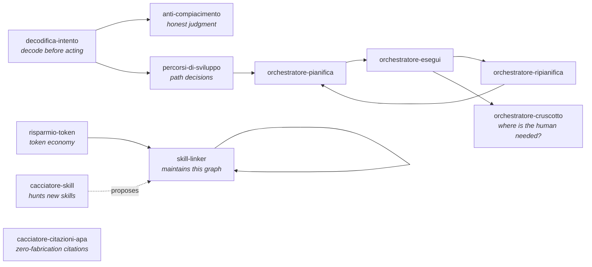

# Claude Second Brain

**A living skill ecosystem for Claude Code — not a prompt collection, an operating system for how an AI collaborator should think before it acts.**

Most Claude Code skill repos are catalogs: isolated prompts you have to remember to invoke. This is something else — a **connected system** where every skill knows what comes after it, judgment is protected from sycophancy by hard rules, and every ambiguous request gets decoded before a single file is touched.

The skills are written in Italian. The **method is language-agnostic** — and the method is the actual product here. Translate freely; the architecture survives translation.

## The three principles

Every skill in this system was admitted only if it passed three gates:

1. **Self-management** — the system works without constant manual intervention. Skills update themselves, registries track state, nothing depends on you remembering.
2. **Biological organicity** — skills are organs: they are born, they connect, they specialize. An isolated skill is dead tissue. Every skill ends with a "Prossime skill" (next skills) section: 2–4 *choosable consequences* derived from what the process actually produced, so no session ends in a dead end.
3. **Inertia** — every addition must increase the system's capacity to grow on its own.

## The graph



The graph is not documentation — it is **maintained by one of its own nodes** (`skill-linker`), which adds a standard handoff section to every skill, one at a time, and keeps a registry of edges. Missing links are tracked as "gray links": the system's natural to-do list.

## The skills

| Skill | What it does |
|---|---|
| `decodifica-intento` | Decodes every ambiguous request **before acting**: classifies intent (action / judgment / thinking aloud / study / venting), decides whether to ask or infer, always declares the chosen reading. The most expensive moment of a session is an action launched from a misread request. |
| `anti-compiacimento` | Total ban on complacent lying: no unverified confirmations, no inflated praise, no minimized problems, no position changes under pressure without new facts. Every judgment in two parts: what works / what doesn't, labeled *verified fact / opinion / hypothesis*. |
| `skill-linker` | Turns every skill into a graph node: standard "next skills" section (2–4 condition → skill links), edge registry, one skill per update. The reason this repo is a system and not a folder. |
| `risparmio-token` | Token economy in three modes: operating rules during work, setup audit (CLAUDE.md, MCP, skills), and design of token-efficient artifacts. Based on Anthropic's documented techniques. |
| `orchestratore-pianifica` | Turns a concrete objective into an executable `PIANO.md` task sequence. |
| `orchestratore-esegui` | Executes tasks from `PIANO.md`, resuming exactly where the last session stopped. |
| `orchestratore-ripianifica` | Updates a plan incrementally when reality diverges — never rewrites from scratch. |
| `orchestratore-cruscotto` | Read-only control tower over all active plans. Answers one question: *where is the human actually needed?* |
| `percorsi-di-sviluppo` | Turns research output or vague ambitions into 2–4 comparable development paths built on the user's real profile — each with pros, structural cons (don't disappear with effort), plannable difficulties, first 3 steps, and an **abandonment signal**. |
| `cacciatore-skill` | The procurement organ: hunts and evaluates new skills (GitHub, marketplaces) against the three principles. Reports only — never installs. |
| `cacciatore-citazioni-apa` | Finds REAL, verifiable academic citations (PubMed E-utilities, Google Scholar), formats APA 7, extracts verbatim quotes. Absolute fabrication ban. |

## Design patterns worth stealing

Even if you never run these skills, four patterns transfer to any Claude Code setup:

- **Choosable consequences over dead ends.** Every process ends with 2–4 options derived from *actual outputs* ("if the report reveals stalled projects → project-management skill"), plus an explicit exit ("or stop here"). Condition first, tool second.
- **Decode before acting.** A permanent memory rule points to the decoding skill, guaranteeing the hook fires even when the ambiguous request doesn't resemble any skill description. Memory guarantees the trigger; the skill contains the method.
- **Anti-sycophancy as architecture, not intention.** "Be honest" doesn't survive contact with a user who insists. Hard prohibitions with a declared rationale do: *insistence is data about mood, not about the object*.
- **Skills that maintain skills.** The graph maintainer is itself a skill, with non-negotiable rules (one skill at a time, diff before writing, registry updated in the same task).

## Install

Copy any skill folder into your Claude Code skills directory:

```bash
git clone https://github.com/NickAme03/claude-second-brain
cp -r claude-second-brain/skills/* ~/.claude/skills/
```

Each skill is a standard `SKILL.md` (+ optional `references/`). They work independently — but they work *better* together, because the handoff sections reference each other. Start with `decodifica-intento` + `anti-compiacimento`: they are the immune system.

Skills reference a `<vault>` placeholder where they touch an Obsidian vault — replace with your own paths, or delete those lines if you don't use Obsidian.

### First run

Open any Claude Code session and type an ambiguous request — something like:

> *"sistemami il progetto"* ("fix up my project")

`decodifica-intento` fires **before anything is touched**: it classifies your intent (action? judgment? thinking aloud?), declares the reading it has chosen, and only then acts. If it guessed wrong, you correct one sentence instead of undoing an hour of misdirected work.

That's the whole system in one interaction: decode first, act second, and end with choosable next steps instead of a dead end.

## Nota per chi legge in italiano

Le skill sono nate in italiano e in italiano restano: sono il sistema operativo reale di un vault Obsidian ("Secondo Cervello") in uso quotidiano, non un esercizio. Se lavori in italiano con Claude Code, funzionano così come sono: copiale in `~/.claude/skills/` e parti da `decodifica-intento`.

## Status

This is a **living system**, published as-is from daily use. It will evolve: the update log lives in the commit history, which is the point — *build in public*. Issues and discussions welcome, in English or Italian.

## License

MIT
